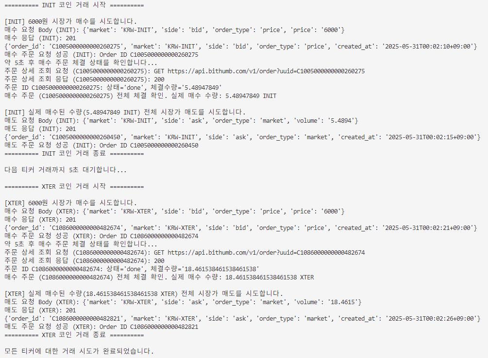

# 빗썸 에어드랍 자동 참여 스크립트 (Bithumb Auto Airdrop)

빗썸에서 진행하는 특정 코인 에어드랍 이벤트 참여를 위해 자동으로 매수 후 매도 주문을 실행하는 Python 스크립트입니다.

## 주요 기능

-   지정된 코인 티커 목록(`COIN_TICKERS`)에 대해 순차적으로 거래를 수행합니다.
-   각 코인에 대해 설정된 거래 금액(`TRADE_AMOUNT`)만큼 시장가 매수를 시도합니다.
-   매수 주문 후, 해당 주문의 실제 체결량을 조회합니다. (빗썸 API `GET /v1/order` 사용)
-   조회된 실제 체결 수량만큼 시장가 매도를 시도합니다.
-   API 키는 `.env` 파일을 통해 안전하게 관리합니다.
-   빗썸 Private API v1 (개별 주문 조회) 및 v2 (주문 실행)를 사용합니다.

## 준비 사항

1.  **Python 3** 설치 (Python 3.7 이상 권장)
    *   Anaconda 사용자의 경우, Anaconda Prompt 또는 터미널에서 새 환경을 만들거나 기존 환경을 사용할 수 있습니다.
2.  **필요 라이브러리**:
    *   `requests`
    *   `python-dotenv`
    *   `PyJWT`
3.  **빗썸 API 키 발급**:
    *   빗썸 웹사이트에서 Access Key와 Secret Key를 발급받아야 합니다.
    *   API 키는 반드시 '거래' 권한을 가지고 있어야 합니다.

## 사용 방법

1.  **리포지토리 클론**:
    ```bash
    git clone https://github.com/assistonia/bithumb_autoairdrop.git
    cd bithumb_autoairdrop
    ```

2.  **가상 환경 생성 및 활성화 (권장)**:
    ```bash
    python -m venv venv
    # Windows
    venv\Scripts\activate
    # macOS/Linux
    source venv/bin/activate
    ```

3.  **필요 라이브러리 설치**:
    (프로젝트 루트에 `requirements.txt` 파일이 제공됩니다.)
    *   **pip 사용 시**:
        ```bash
        pip install -r requirements.txt
        ```
    *   **Anaconda 사용 시**: `requirements.txt` 파일 내의 각 라이브러리를 `conda install <라이브러리명>` 또는 `pip install <라이브러리명>` 명령어를 사용하여 설치합니다. (conda 환경 내에서도 pip 사용 가능)
        ```bash
        # 예시
        conda install requests
        pip install python-dotenv pyjwt
        ```

4.  **`.env` 파일 설정**:
    *   제공된 `.env.example` 파일을 `.env` 파일로 복사합니다.
    *   `.env` 파일을 열어 실제 발급받은 빗썸 Access Key와 Secret Key를 입력합니다.
    ```env
    BITHUMB_ACCESS_KEY="YOUR_ACCESS_KEY_HERE"
    BITHUMB_SECRET_KEY="YOUR_SECRET_KEY_HERE"
    ```

5.  **스크립트 설정 수정 (`autoairdrop.py`)**:
    *   `autoairdrop.py` 파일 상단의 사용자 설정 구간에서 거래를 원하는 코인 티커 목록(`COIN_TICKERS`)과 각 코인별 거래 금액(`TRADE_AMOUNT`) 등을 필요에 맞게 수정합니다.
    *   `TRADE_AMOUNT`는 최소 주문 금액(일반적으로 5,000원) 이상으로 설정해야 하며, 안정적인 주문 체결을 위해 6,000원으로 초기 설정되어 있습니다.
    ```python
    # 예시
    COIN_TICKERS = ['FLOCK', 'INIT', 'XTER']
    TRADE_AMOUNT = 6000  # 원
    ```

6.  **스크립트 실행**:
    ```bash
    python autoairdrop.py
    ```
    스크립트가 실행되면 설정된 코인들에 대해 순차적으로 매수 및 매도 주문을 시도하고 관련 로그를 터미널에 출력합니다.

## 주의 사항

-   **투자 책임**: 본 스크립트는 자동 거래를 위한 도구일 뿐이며, 모든 투자 결정과 그에 따른 책임은 사용자 본인에게 있습니다. 시장 상황 및 코인 변동성에 유의하십시오.
-   **API 키 보안**: API Access Key와 Secret Key는 매우 민감한 정보입니다. `.env` 파일이 `.gitignore`에 포함되어 있는지 항상 확인하고, 절대로 공개된 장소(예: Public GitHub 리포지토리)에 직접 업로드하지 마십시오.
-   **빗썸 API 정책**: 빗썸의 API 이용 약관, 호출 제한, 정책 등은 변경될 수 있습니다. 스크립트 사용 전후로 관련 내용을 숙지하십시오. 빗썸 API 공식 문서([https://apidocs.bithumb.com/](https://apidocs.bithumb.com/)) 및 주문 가능 정보([https://apidocs.bithumb.com/reference/%EC%A3%BC%EB%AC%B8-%EA%B0%80%EB%8A%A5-%EC%A0%95%EB%B3%B4](https://apidocs.bithumb.com/reference/%EC%A3%BC%EB%AC%B8-%EA%B0%80%EB%8A%A5-%EC%A0%95%EB%B3%B4))를 참고하세요.
-   **최소 주문 수량 및 소수점**: `autoairdrop.py` 내 `market_sell` 함수에서 매도 수량을 문자열로 변환할 때 `quantize(decimal.Decimal('0.0001'), ...)` 부분이 있습니다. 이는 코인의 소수점 4자리까지 지원한다고 가정한 예시입니다. 실제 거래하려는 각 코인의 최소 주문 수량 및 지원하는 소수점 자릿수를 빗썸에서 확인하고, 해당 부분의 `'0.0001'` 값을 적절히 수정해야 정상적인 주문이 가능합니다.
-   **네트워크 및 API 오류**: 네트워크 문제나 일시적인 API 오류로 인해 주문이 실패하거나 정보 조회가 원활하지 않을 수 있습니다. 스크립트 로그를 통해 오류 상황을 확인하십시오.

## 기여

버그를 발견하거나 개선 사항이 있다면 언제든지 Issues 또는 Pull Requests를 통해 기여해주세요.

**이 스크립트가 유용하다고 생각되시면 GitHub 리포지토리에 ⭐️ Star를 눌러주세요!**

## 실행 결과 (Execution Result)

아래는 스크립트 실행 시 터미널에 출력되는 예상 결과입니다. (INIT, XTER 코인 거래 예시)



## 라이선스

MIT License (추후 명시 예정) 